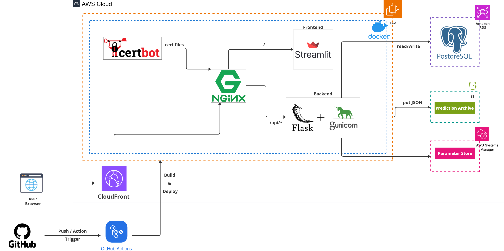
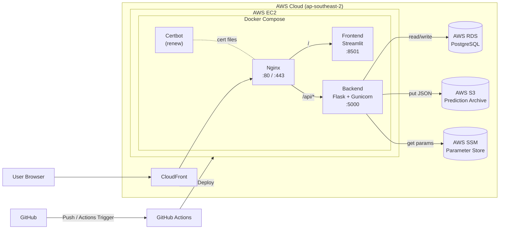

# AI 기반 야구 투수 교체 의사결정 지원 서비스

## 1. 프로젝트 개요
### 프로젝트명
AI 기반 야구 투수 교체 의사결정 지원 서비스

### 문제 정의 및 목표
투수 교체 판단은 이닝, 투구 수, 구속 저하, 실점, 타자 상성 등 다변수를 짧은 시간 안에 판단해야 합니다.  
기존 경험 중심 의사결정을 보완할 수 있는 정량 기반 지원 시스템이 필요했습니다.

따라서 예측 모델을 API와 대시보드로 제공하고, 실제 운영 가능한 클라우드 구조(배포, 보안, 저장, 복구)까지 포함한 엔드투엔드 서비스를 구현합니다.

### 핵심 범위 (아키텍처/구현)
- 서비스: 예측 API, 상태 API, 불펜 대시보드
- 인프라: EC2, CloudFront, SSM Parameter Store, RDS, S3
- 운영: GitHub Actions 자동 배포, HTTPS, 트러블슈팅/런북 기반 운영

### 요구사항 요약
#### 기능 요구사항
- 경기 입력값으로 교체 확률/권장 결과를 JSON으로 반환
- 대시보드에서 팀/상황 입력, 예측 결과, 상태 정보 확인
- 예측 요청/응답을 RDS에 저장하고 동일 데이터를 S3에 아카이빙
- 외부 로스터 수집 실패 시 fallback으로 핵심 기능 지속

#### 비기능 요구사항
- 가용성: 단일 EC2 환경에서 서비스 연속성 유지, 장애 시 롤백 가능
- 보안: 비밀값은 SSM(SecureString)으로 관리, HTTPS 및 최소권한 SG/IAM 적용
- 비용: 프리 티어/저비용 운영 + Budget/Free Tier 알림으로 과금 리스크 통제
- 운영성: 배포 자동화 + `/health`, `/infra/status` 기반 운영 점검

---

## 2. 아키텍처 설계

아래는 동일 구성을 텍스트로 확인할 수 있는 `mermaid` 버전입니다.

---

## 3. 아키텍처 의사결정
### EC2 + Docker Compose 선택 이유
- 프리 티어/저비용 제약에서 가장 빠르게 운영 가능한 구조
- 단일 인스턴스 기반으로 배포/장애 대응/문서화 완성에 적합
- 복잡한 오케스트레이션보다 "운영 가능한 최소 구조" 우선

### CloudFront / SSM / RDS / S3 채택 이유
- CloudFront: 사용자 접근 안정화, HTTPS 엣지 제공, 경로 기반 라우팅 보완
- SSM: 비밀값/환경설정의 코드 분리 및 중앙 관리
- RDS: 예측 요청/응답 구조화 저장(추적/검증/회고)
- S3: 예측 이벤트 원본 JSON 아카이빙(감사/복구/분석)

---

## 4. 보안 및 배포·운영 자동화
### 보안 원칙
- IAM 최소권한과 보안 그룹 최소 개방으로 접근 통제
- 비밀값(DB URL, API 키)은 SSM Parameter Store(SecureString)로 관리해 코드/저장소와 분리
- 사용자 트래픽은 Nginx + Certbot + CloudFront 기반 HTTPS로 보호

### 배포 자동화
- GitHub Actions로 이미지 빌드/배포/재기동 자동화
- 배포 시 시크릿을 `.env`에 주입하고 서버 환경 차이(Compose 버전)는 스크립트에서 흡수
- HTTPS 설정 유실 방지를 위해 배포 파이프라인에 자동 적용 단계 포함

### 운영 안정화
- `/health`, `/api/infra/status`, `/api/infra/predictions`로 상태 상시 점검
- 장애 시 이전 이미지로 롤백 가능한 절차 마련, runbook으로 표준화
- 외부 의존 기능(로스터 크롤링)은 기본 OFF + fallback 전략으로 서비스 연속성 확보

---

## 5. 트러블슈팅 사례
### 5-1. 배포 이슈
#### Docker Compose 배포 실패
- 문제: EC2 배포 단계에서 Compose 오류로 실패
- 원인: 서버별 Compose 설치/버전 불일치
- 조치: Compose 설치 및 `docker compose`/`docker-compose` 자동 감지 적용
- 결과: 배포 파이프라인 정상화
- 재발방지: 실행 환경 흡수형 배포 스크립트 유지

#### 재배포 후 HTTPS 초기화
- 문제: 배포 후 HTTPS가 HTTP 설정으로 되돌아감
- 원인: 배포 시 Nginx 설정 파일 덮어쓰기
- 조치: HTTPS 적용 스크립트 개선 + 배포 후 자동 실행
- 결과: 재배포 후 HTTPS 지속 유지
- 재발방지: 수동 HTTPS 절차를 CI/CD에 내장

#### SSM 값 미로드 (`loaded=0`)
- 문제: SSM 활성화 상태인데 파라미터 주입 실패
- 원인: 앱 조회 리전과 SSM 생성 리전 불일치
- 조치: 리전 통일 및 파라미터 이름 명시
- 결과: `ssm.loaded` 정상 증가 확인
- 재발방지: 배포 전 리전/계정/경로 사전 점검

### 5-2. 운영 이슈
#### CloudFront 경유 API 301/504
- 문제: CloudFront 도메인에서 API가 리다이렉트/타임아웃
- 원인: 오리진/프로토콜/동작 설정 불일치
- 조치: 오리진/Behavior 경로 정책 재정렬
- 결과: CloudFront 경유 `/api/health` 200 복구
- 재발방지: CDN 변경 시 경로별 검증 체크리스트 적용

#### Streamlit WebSocket 실패
- 문제: 대시보드 로딩 정체 및 `/_stcore` 오류
- 원인: WebSocket 경로/프록시 타임아웃 설정 부족
- 조치: Nginx WebSocket 헤더/timeout 보강 + CloudFront 경로 보완
- 결과: 화면 로딩/상호작용 정상화
- 재발방지: Streamlit 운영 시 WebSocket 점검 항목 상시 유지

#### 로스터 수집 실패 반복
- 문제: Selenium 기반 로스터 조회 실패로 화면 오류
- 원인: 운영 컨테이너에서 브라우저 자동화 불안정
- 조치: 로스터 기능 기본 OFF + fallback 계산 적용
- 결과: 외부 수집 실패 시에도 핵심 기능 지속
- 재발방지: 실시간 크롤링 의존 기능을 배치/캐시 중심으로 전환

---

## 6. 비용 설계
### 프리 티어 제약 하 설계 원칙
- 고비용 관리형 구성(ECS/Fargate/ALB) 제외, 단일 EC2 + Docker Compose 중심 설계
- 서비스 연속성은 유지하되 초기 단계에서는 비용 효율 우선
- CloudFront/SSM/RDS/S3는 필요한 범위만 단계 도입해 비용 급증 방지

### 비용 상한/알림/절감 전략
- AWS Budget(0/1/3달러 구간) 및 Free Tier usage alert 설정
- 미사용 리소스(EIP, 스냅샷, 불필요 로그) 정리 + 로그 보관 기간 제한
- 단일 리전 운영, 최소 스펙 유지, 불필요한 실시간 크롤링 축소로 운영비 변동성 완화
